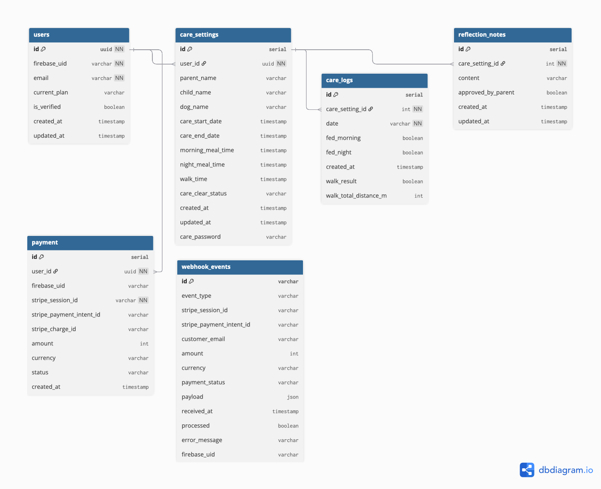

# 💾 データベース設計書 - わん 🐾 みっしょん

## 1. 概要

「わん 🐾 みっしょん」は、親子が犬のお世話を学びながら、日々のタスク、散歩機能、反省文機能、有料プランの管理などをサポートする Web アプリです。本設計書は、本アプリの機能を支えるデータベース構造について記載します。

本システムは PostgreSQL を用い、ユーザー管理、ケア設定、お世話ログ、反省文、決済情報、外部サービス連携イベント等をデータベースで一元管理します。

---

## 2. ER 図

---

## 3. テーブル一覧

| テーブル名       | 概要・用途                               |
| ---------------- | ---------------------------------------- |
| users            | アプリのユーザー（親/子供）情報管理      |
| care_settings    | 各ユーザーごとの犬のお世話計画や設定     |
| care_logs        | お世話の実施記録（例：ご飯や散歩の実績） |
| reflection_notes | 反省文(お世話をサボったときの振り返り)   |
| payment          | 有料プランの決済履歴                     |
| webhook_events   | Stripe 等の外部決済イベント情報          |

---

## 4. 個別テーブルの詳細

### 4.1 users テーブル

**概要**: Firebase 認証と連携したユーザー情報を管理

| カラム名     | 型       | 制約        | 説明                           |
| ------------ | -------- | ----------- | ------------------------------ |
| id           | String   | PRIMARY KEY | UUID 形式の一意識別子          |
| firebase_uid | String   | UNIQUE      | Firebase Authentication の UID |
| email        | String   | UNIQUE      | ユーザーのメールアドレス       |
| current_plan | String   | NULL 可     | 現在のプラン (free/premium)    |
| is_verified  | Boolean  | NULL 可     | メールアドレス認証状態         |
| created_at   | DateTime | DEFAULT NOW | レコード作成日時               |
| updated_at   | DateTime | AUTO UPDATE | レコード更新日時               |

### 4.2 care_settings テーブル

**概要**: 各ユーザーの犬のお世話に関する設定情報

| カラム名          | 型       | 制約        | 説明                       |
| ----------------- | -------- | ----------- | -------------------------- |
| id                | Int      | PRIMARY KEY | 自動増分の一意識別子       |
| user_id           | String   | FOREIGN KEY | users テーブルの id を参照 |
| parent_name       | String   | NULL 可     | 保護者の名前               |
| child_name        | String   | NULL 可     | 子どもの名前               |
| dog_name          | String   | NULL 可     | 犬の名前                   |
| care_start_date   | DateTime | NULL 可     | お世話開始日               |
| care_end_date     | DateTime | NULL 可     | お世話終了日               |
| morning_meal_time | DateTime | NULL 可     | 朝食時間                   |
| night_meal_time   | DateTime | NULL 可     | 夕食時間                   |
| walk_time         | DateTime | NULL 可     | 散歩時間                   |
| care_clear_status | String   | NULL 可     | お世話完了ステータス       |
| care_password     | String   | NULL 可     | 管理者 PIN                 |
| created_at        | DateTime | DEFAULT NOW | レコード作成日時           |
| updated_at        | DateTime | AUTO UPDATE | レコード更新日時           |

### 4.3 care_logs テーブル

**概要**: 日々のお世話実施記録

| カラム名              | 型       | 制約        | 説明                               |
| --------------------- | -------- | ----------- | ---------------------------------- |
| id                    | Int      | PRIMARY KEY | 自動増分の一意識別子               |
| care_setting_id       | Int      | FOREIGN KEY | care_settings テーブルの id を参照 |
| date                  | String   | NULL 可     | お世話実施日（YYYY-MM-DD 形式）    |
| fed_morning           | Boolean  | NULL 可     | 朝食実施フラグ                     |
| fed_night             | Boolean  | NULL 可     | 夕食実施フラグ                     |
| walk_result           | Boolean  | NULL 可     | 散歩実施フラグ                     |
| walk_total_distance_m | Int      | NULL 可     | 散歩総距離（メートル）             |
| created_at            | DateTime | DEFAULT NOW | レコード作成日時                   |

### 4.4 reflection_notes テーブル

**概要**: お世話に対する子どもの反省文と保護者の承認状況

| カラム名           | 型       | 制約          | 説明                               |
| ------------------ | -------- | ------------- | ---------------------------------- |
| id                 | Int      | PRIMARY KEY   | 自動増分の一意識別子               |
| care_setting_id    | Int      | FOREIGN KEY   | care_settings テーブルの id を参照 |
| content            | String   | NULL 可       | 反省文の内容                       |
| approved_by_parent | Boolean  | DEFAULT FALSE | 保護者による承認状況               |
| created_at         | DateTime | DEFAULT NOW   | レコード作成日時                   |
| updated_at         | DateTime | AUTO UPDATE   | レコード更新日時                   |

### 4.5 payment テーブル

**概要**: Stripe 決済履歴とプレミアムプラン管理

| カラム名                 | 型       | 制約        | 説明                           |
| ------------------------ | -------- | ----------- | ------------------------------ |
| id                       | Int      | PRIMARY KEY | 自動増分の一意識別子           |
| user_id                  | String   | FOREIGN KEY | users テーブルの id を参照     |
| firebase_uid             | String   | NULL 可     | Firebase Authentication の UID |
| stripe_session_id        | String   | UNIQUE      | Stripe Checkout セッション ID  |
| stripe_payment_intent_id | String   | NULL 可     | Stripe Payment Intent ID       |
| stripe_charge_id         | String   | NULL 可     | Stripe Charge ID               |
| amount                   | Int      | NULL 可     | 決済金額（セント単位）         |
| currency                 | String   | NULL 可     | 通貨コード (jpy, usd 等)       |
| status                   | String   | NULL 可     | 決済ステータス                 |
| created_at               | DateTime | DEFAULT NOW | レコード作成日時               |

### 4.6 webhook_events テーブル

**概要**: Stripe Webhook イベントの受信・処理管理

| カラム名                 | 型       | 制約          | 説明                                           |
| ------------------------ | -------- | ------------- | ---------------------------------------------- |
| id                       | String   | PRIMARY KEY   | Stripe イベント ID                             |
| event_type               | String   | NULL 可       | イベントタイプ (checkout.session.completed 等) |
| stripe_session_id        | String   | NULL 可       | Stripe セッション ID                           |
| stripe_payment_intent_id | String   | NULL 可       | Stripe Payment Intent ID                       |
| customer_email           | String   | NULL 可       | 顧客メールアドレス                             |
| amount                   | Int      | NULL 可       | 金額（セント単位）                             |
| currency                 | String   | NULL 可       | 通貨コード                                     |
| payment_status           | String   | NULL 可       | 支払いステータス                               |
| payload                  | Json     | NULL 可       | Webhook イベントの完全なペイロード             |
| received_at              | DateTime | DEFAULT NOW   | イベント受信日時                               |
| processed                | Boolean  | DEFAULT FALSE | 処理完了フラグ                                 |
| error_message            | String   | NULL 可       | 処理エラーメッセージ                           |
| firebase_uid             | String   | NULL 可       | Firebase Authentication の UID                 |

---

## 5. テーブル間の関係

### 主要な関係性

1. **users ↔ care_settings** (1:1)

   - 1 人のユーザーは一つのお世話設定を持つことができる

2. **care_settings ↔ care_logs** (1:N)

   - 1 つのお世話設定に対して複数の日々の記録が存在

3. **care_settings ↔ reflection_notes** (1:N)

   - 1 つのお世話設定に対して複数の反省文が存在

4. **webhook_events** (独立)
   - 外部システムからのイベントを記録するため、直接的な関係は持たない

---
