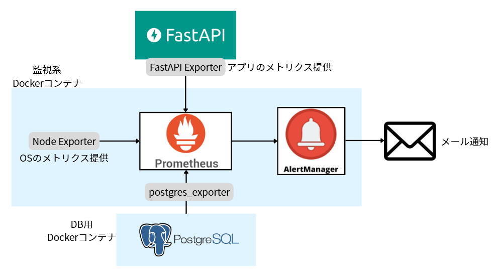

# 監視・アラート設計書

## 概要

本ドキュメントは、アプリケーションの安定運用を目的として、Prometheus を用いた監視・アラートの設計方針をまとめたものです。

---

## 使用ツール

| ツール                      | 役割                               |
| --------------------------- | ---------------------------------- |
| Prometheus                  | メトリクスの収集・監視             |
| Alertmanager                | アラート条件に応じた通知管理       |
| Postgres Exporter           | サーバーの CPU・メモリ等の情報収集 |
| Node Exporter               | OS の CPU・メモリ等の情報収集      |
| Mail サーバー（Gmail SMTP） | アラートの通知先                   |

---

## 監視対象とアラートルール

| 項目             | メトリクス名                          | しきい値                | for | 役割                   | 通知先 |
| ---------------- | ------------------------------------- | ----------------------- | --- | ---------------------- | ------ |
| レスポンスタイム | `http_request_duration_seconds`       | > 3.0                   | 5m  | アプリの応答遅延を検知 | Gmail  |
| CPU 使用率       | `node_cpu_seconds_total{mode="idle"}` | < 10%（＝使用率 > 90%） | 1m  | サーバー高負荷の検知   | Gmail  |

---

## 構成図



---

## アラート通知設定例（Prometheus Alert Rule）

```yaml
groups:
  - name: app-alerts
    rules:
      - alert: HighResponseTime
        expr: avg_over_time(http_request_duration_seconds[5m]) > 3
        for: 5m
        labels:
          severity: warning
        annotations:
          summary: "レスポンスタイム高騰"
          description: "5分間の平均レスポンスタイムが3秒を超えています。"

      - alert: HighCPUUsage
        expr: 100 - (avg by(instance)(irate(node_cpu_seconds_total{mode="idle"}[1m])) * 100) > 90
        for: 1m
        labels:
          severity: critical
        annotations:
          summary: "CPU使用率が高い"
          description: "CPU使用率が90%以上を1分間継続しています。"
```

---

## 備考

- Prometheus, Postgres Exporter, Alertmanager, Node Expoter は docker-compose で一括管理する想定
- メール通知は SMTP サーバー経由で実装

---

## 監視系ディレクトリ起動手順

## 手順 ①：`alertmanager.yml` を `/monitoring` に作成（メアド・smtp_auth_password は各自で変更）

```bash
global:
  smtp_smarthost: "smtp.gmail.com:587"
  smtp_from:youremail@gmail.com
  smtp_auth_username: youremail@gmail.com
  smtp_auth_password: mxxxxxxxxxxxxxxx # アプリパスワード

route:
  receiver: "gmail-notify"

receivers:
  - name: "gmail-notify"
    email_configs:
      - to: youremail@gmail.com
        send_resolved: true

```

- `smtp_auth_password` には **Google のアプリパスワード（16 桁）** を使ってください
- **Git 管理外（.gitignore）にしてるので安心して書き込んで OK です**（prometheus は.env を読み込めないのでべた書きです）

### 🔐 アプリパスワードの発行方法（Gmail）

```bash
Googleアカウントを管理
↓
検索で「アプリパスワード」と入力
↓
パスワード再入力 → アプリ作成 → 発行
※一度閉じたら二度と見れないのでコピペ保存！
```

## 手順 ②：ドッカーコンテナ起動

```bash
docker-compose up -d
```

以下が立ち上がります

| ツール名          | アクセス先                                      | 機能                            |
| ----------------- | ----------------------------------------------- | ------------------------------- |
| Prometheus        | [http://localhost:9090](http://localhost:9090/) | メトリクス確認 / アラート状態   |
| Alertmanager      | [http://localhost:9093](http://localhost:9093/) | 通知の送信状態                  |
| postgres-exporter | http://localhost:9187/metrics                   | PostgreSQL のメトリクス         |
| node-exporter     | http://localhost:9100/metrics                   | OS メトリクス（CPU/メモリなど） |

※OS による混乱を防ぐため、Node Exporter もコンテナ起動しています

## 手順 ③：`prometheus-fastapi-instrumentator` インストール

```
cd backend
```

仮想環境有効後、

```python
# 仮想環境の有効化
source venv/bin/activate
```

**必要パッケージのインストールをおねがいします**

```
pip install -r requirements.txt
```

インストール済みか確認 → Version: 5.9.1 の行があれば OK

```
pip show prometheus-fastapi-instrumentator
```

## 手順 ④：起動しているか・Prometheus の監視対象になっているか確認

- 全コンテナが起動しているか確認

```bash
docker ps
```

- `http://localhost:9090/targets` → 全 Exporter が `UP` になっているか

### 監視系ドッカーコンテナだけ停止したい場合

```bash
docker compose stop prometheus alertmanager postgres-exporter node-exporter
```

### ---------------　　！！ここからは余裕があれば！！　　------------------

## 手順 ⑤：起動確認テスト

### 1⃣Section9_TeamC\monitoring\alert_rules.yml の以下のコード有効化

- #テスト用 ①：レスポンスタイムテスト

```bash
      - alert: HighResponseTime2
        expr: (rate(http_request_duration_seconds_sum{handler="/slow"}[1m]) / rate(http_request_duration_seconds_count{handler="/slow"}[1m])) > 1
        for: 30s
        labels:
          severity: warning
        annotations:
          summary: "レスポンスタイムが高騰しています"
          description: "HTTPレスポンスの平均時間が30秒間で1秒を超えました。"
```

- # テスト用 ②：CPU 使用率が 1％を超えたら通知

```bash
      - alert: HighCPUUsage2
        expr: 100 - (avg by(instance)(irate(node_cpu_seconds_total{mode="idle"}[1m])) * 100) > 0.5
        for: 10s
        labels:
          severity: critical
        annotations:
          summary: "CPU使用率が高すぎます"
          description: "CPU使用率が10秒間0.5%を超えています。"

```

### 2⃣backend/app/main.py の一番下のコード有効化

```bash
# レスポンスタイム遅延テスト用エンドポイント
 import time

 @app.get("/slow")
 async def slow_endpoint():
     """わざと5.0秒待つ遅いレスポンス（Prometheusのalertテスト用）"""
     time.sleep(5.0)
     return {"message": "This is a slow response"}
```

### 3⃣postman でエンドポイント叩きまくる 🌱

```bash
GET http://localhost:8000/slow
```

[`http://localhost:9090/alerts`](http://localhost:9090/alerts)にアクセスして、HighResponseTime2 が`PENDING`になればもうすぐ！`FIRING`になればメール届く（1 分後に届くことも！※時差有）

### 4⃣ メール届いたら、「レスポンスタイムが〇秒を超えた場合にメール通知」テストクリア！

---

### 5⃣mac ユーザー向け：CPU 使用率を上げるコマンド

```bash
yes > /dev/null &
yes > /dev/null &
yes > /dev/null &
yes > /dev/null &
```

- Prometheus UI で CPU 使用率確認できます！

  ⭐CPU 使用率確認クエリ（Prometheus Graph）

  ```bash
  100 - (avg by(instance)(irate(node_cpu_seconds_total{mode="idle"}[1m])) * 100)
  ```

  1. [`http://localhost:9090](http://localhost:9090/)` にアクセス
  2. 「Graph」タブを開く
  3. 上記クエリを入力して「Execute」を押すと、CPU 使用率のグラフが表示されます

- [`http://localhost:9090/alerts`](http://localhost:9090/alerts)にアクセスして、HighCPUUsage2 が`PENDING`になればもうすぐ！`FIRING`になればメール届く（1 分後に届くことも！※時差有）

- CPU 使用率を上げるコマンドの終了忘れずに！

```bash
killall yes
```

### 5⃣Windows ユーザー向け：CPU 使用率を上げるコマンド

```bash
Start-Job { while ($true) {} }
Start-Job { while ($true) {} }
Start-Job { while ($true) {} }
Start-Job { while ($true) {} }
```

- コマンド終了も忘れずに！

```bash
Get-Job | Stop-Job
Get-Job | Remove-Job
```

### 6⃣ メール届けば「サーバーの CPU 使用率が〇％を超えたらアラート発生」テストクリア！
