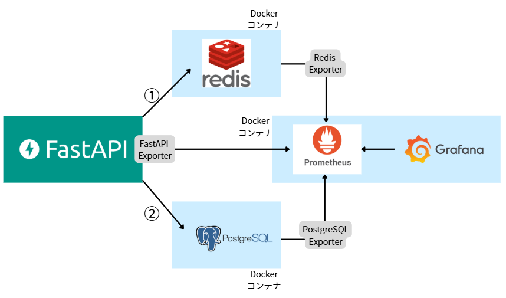

# 📄 Redis キャッシュとリソース管理設計書

## 1. 概要

本設計書は、FastAPI アプリケーションに Redis キャッシュを導入し、レスポンス性能と DB 負荷を最適化することを目的とする。
キャッシュ対象 API は、主に**頻繁に読み取られるが更新頻度が低い GET エンドポイント**とし、以下の観点で設計を行う：

- キャッシュ導入の妥当性
- キャッシュキーの粒度と TTL
- パフォーマンス向上の見込み
- リソース（メモリ/I/O）管理

---

## 2. 対象システム・構成

| 項目                   | 内容                                    |
| ---------------------- | --------------------------------------- |
| アプリケーション       | FastAPI（Python）                       |
| キャッシュバックエンド | Redis（Docker コンテナ）                |
| キャッシュライブラリ   | `fastapi-cache2` + `aioredis`           |
| DB                     | PostgreSQL                              |
| 監視ツール             | Prometheus + FastAPI Exporter + Grafana |

---

## 3. システム構成図



- クライアント（Next.js）は FastAPI にアクセス
- FastAPI は Redis を確認し、キャッシュヒット時は即レスポンス（①）
- キャッシュが無い場合は PostgreSQL に問い合わせ、結果を Redis にキャッシュ(②)
- FastAPI のメトリクスは FastAPI Exporter を通じて Prometheus が監視
- Prometheus は各 Exporter からメトリクスを収集し、Grafana がそれを可視化 → CPU やメモリ、I/O の使用状況を確認

---

## 4. キャッシュ導入対象の API

Redis キャッシュの導入にあたり、GET エンドポイントに対して以下の観点から対象を評価した：

- 副作用がない（読み取り専用）
- データの更新頻度が低い
- 最新情報でなくてもユーザー体験に問題がない
- クエリパラメータ等でキャッシュキーを一意に定義できる

### 4.1 対象エンドポイント

| エンドポイント           | メソッド | 概要                                     | キャッシュ有効性                                            |
| ------------------------ | -------- | ---------------------------------------- | ----------------------------------------------------------- |
| `/api/care_logs/list`    | GET      | 特定ユーザーの過去のお世話記録を一覧表示 | ✅ 読み取り頻度高・更新頻度低                               |
| `/api/care_logs/by_date` | GET      | 指定日のお世話記録取得                   | ✅ クエリでキャッシュキー分割可能                           |
| `/api/care_settings/me`  | GET      | 設定情報の取得                           | ⬜ 条件付きで有効。ユーザー設定の変更頻度に応じて適用を検討 |

### 4.2 対象外としたエンドポイント

| エンドポイント          | 理由                                                                                     |
| ----------------------- | ---------------------------------------------------------------------------------------- |
| `/api/care_logs/today`  | 状態が 1 日の中で頻繁に変わるため、キャッシュが情報の正確性を損なう可能性がある          |
| `/api/reflection_notes` | 承認状態の変化が発生するため、最新の状態を常に返す必要がある                             |
| `/api/users/me`         | ユーザーのプラン状態・認証情報が頻繁に変わるため、安全性・正確性の観点でキャッシュ非推奨 |

---

## 5. キャッシュ設計方針

### 5.1 キー戦略（cache key）

- `user_id` や `date` など、クエリ依存のパラメータをキャッシュキーに含める
- ライブラリの自動キー生成機能に加え、必要に応じて `key_builder` をカスタマイズ

```python
@cache(expire=60, key_builder=lambda f, *args, **kwargs: f"{kwargs['user_id']}:{kwargs.get('date')}")
```

### 5.2 TTL（キャッシュ有効期限）

| エンドポイント           | TTL 秒数 | 理由                                                                 |
| ------------------------ | -------- | -------------------------------------------------------------------- |
| `/api/care_logs/list`    | 60 秒    | 最新性よりも応答速度を重視、1 分単位で十分                           |
| `/api/care_logs/by_date` | 300 秒   | ユーザーごとに過去記録を振り返る用途のため、5 分キャッシュで問題なし |
| `/api/care_settings/me`  | 60 秒    | 最新性よりも応答速度を重視、1 分単位で十分                           |

---

### 5.3 キャッシュクリア戦略

- 更新系エンドポイント（POST / PATCH）呼び出し時、関連キャッシュの削除を将来的に検討
- 例：お世話記録を新規作成後、`care_logs/list`のキャッシュを無効化

---

## 6. リソース管理（メモリ・I/O）

### 6.1 キャッシュによる DB 負荷軽減の期待

| 比較項目          | キャッシュなし     | キャッシュあり                     |
| ----------------- | ------------------ | ---------------------------------- |
| DB クエリ実行回数 | 多                 | 少                                 |
| レスポンスタイム  | 300〜800ms（予想） | 10〜50ms（予想）                   |
| CPU 使用率        | 中程度             | 低減（Redis メモリ処理のため軽量） |

### 6.2 Redis のメモリ設計

- シンプルな文字列キャッシュ（JSON）
- TTL 管理による自動削除 → メモリ枯渇のリスクを最小化
- 必要に応じて `maxmemory-policy` 設定（
  例：`volatile-lru`）

---

## 7. 導入後の評価・検証

### 7.1 ベンチマーク方法

- Postman による `/api/care_logs/list`, `/api/care_logs/by_date`, `/api/care_settings/me` の同時リクエスト性能比較
- Prometheus における `http_response_time_seconds` の平均値モニタリング

※ Firebase トークン不要の認証なしエンドポイントを一時的に用意することで、ベンチマークを簡略化

### 7.2 効果測定指標

| 指標                 | 測定対象                   | 期待値                                     | 実測結果                                                                   |
| -------------------- | -------------------------- | ------------------------------------------ | -------------------------------------------------------------------------- |
| 平均レスポンスタイム | 各エンドポイント           | 200ms → 50ms 以下                          | 191ms → 6ms（`/list`）<br>320ms → 6ms（`/by_date`）<br>37ms → 7ms（`/me`） |
| DB リクエスト数      | PostgreSQL ログ            | キャッシュ対象エンドポイントに対し大幅減少 | Redis ログ確認済み・SET 成功ログあり                                       |
| CPU 負荷             | Prometheus `node_exporter` | 減少傾向（Redis 処理によるオフロード）     | 今後継続観測予定                                                           |

---

## 8. リソース監視の導入（Prometheus + Grafana）

- Node Exporter によって、CPU・メモリ・ネットワーク等の使用状況を収集

- Prometheus でメトリクスを取得し、Grafana ダッシュボードで可視化

- 開発中のボトルネックの特定や、キャッシュ導入後の効果測定に活用

- Prometheus のターゲット確認
  

- Node Exporter のダッシュボード画面で CPU やメモリ監視
  

- Redis のダッシュボード画面（∞％メモリ使用など）
  

---

## 9. まとめ

Redis キャッシュは、ユーザー別・日付別の履歴取得など「参照回数が多く、更新頻度の低い」API に対し、有効に機能する。

本設計では TTL とキー粒度を適切に設計することで、メモリ/I/O バランスも保ちながら、全体のパフォーマンス改善が見込まれる。

今後は、更新系処理に連動したキャッシュ削除の自動化や、Redis メモリの使用状況モニタリングなど、運用面の強化も視野に入れる。

---

本設計および検証は、開発チーム内でのパフォーマンス改善の知見共有および今後の運用フェーズへのスムーズな移行を目的としています。

---

## 10. 起動手順・再現方法

### 10.1 前提

- Docker / Docker Compose がインストールされていること
- `redis`, `postgres`, `prometheus.yml`, `alert_rules.yml` などがすべてプロジェクトルートに揃っていること

### 10.2 起動コマンド

```bash
# コンテナを起動（初回ビルド）
docker-compose up --build -d
```

# Prometheus → http://localhost:9090

# Grafana → http://localhost:3001（admin/admin）

# FastAPI → http://localhost:8000/docs

### 10.3 Grafana 設定

初回ログイン後、以下を設定：

- Data Source: Prometheus → http://prometheus:9090
- ダッシュボード：Node Exporter / Redis Exporter の公式テンプレートをインポート

---

## 11. 参考リンク・資料

- [fastapi-cache2 GitHub](https://github.com/long2ice/fastapi-cache)
- [Prometheus Exporters](https://prometheus.io/docs/instrumenting/exporters/)
- [Grafana Dashboards](https://grafana.com/grafana/dashboards/)
